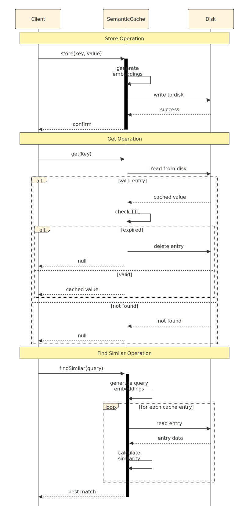

# zcache

A zemantic, ~~no-dependency,~~ file-based cache

There are loads of wonderful, battle-tested caching modules. This is not one of them. But, if you want a ~~no-dependency,~~ file-based cache that can store both semantic and non-semantic queries, this one is for you. A really zimple, zemantic caching module. The only dependency is `@huggingface/transformers` using the `Supabase/gte-small` model for generating embeddings.





Create a cache

```
import { Cache } from '@punkish/zcache';

const options = {
    dir: './cache',
    segment: 'default',
    ttl: 86400000
    similarityThreshold: 0.9
};

// Create a new cache with options
const cache = new Cache(options);

// Initialize the cache
await cache.init();
```

Cache a semantic query

```
const query1 = 'What is the speed of a swallow?';
const response1 = 500;
const isSemantic = true;
const res = await cache.set({ 
    query: query1, 
    response: response1, 
    isSemantic 
});
console.log(res);
// {
//     query: "What is the speed of a swallow?",
//     response: 500,
//     stored: <date>
//     ttl: 86400000
// }
```

Cache a non-semantic query

```
const query2 = 'Half of 1000';
const response2 = 500;
const res = await cache.set({ 
    query: query2, 
    response: response2 
});
console.log(res);
// {
//     query: "Half of 1000",
//     response: 500,
//     stored: <date>
//     ttl: 86400000
// }
```

Retrieve the values

```
const res1 = await cache.get({ query: query2 });
console.log(res1);
// {
//     query: "Half of 1000",
//     response: 500,
//     stored: <date>
//     ttl: 86400000
// }
const res2 = await cache.get({ query: query1, isSemantic });
console.log(res2);
// {
//     query: "What is the speed of a swallow?",
//     response: 500,
//     stored: <date>
//     ttl: 86400000
// }
```

Retrieve another semantic query

```
const query3 = 'How fast does the swallow fly?';
const res = await cache.get({ query: query3, isSemantic });
console.log(res);
// {
//     query: "What is the speed of a swallow?",
//     response: 500,
//     stored: <date>
//     ttl: 86400000
// }
```